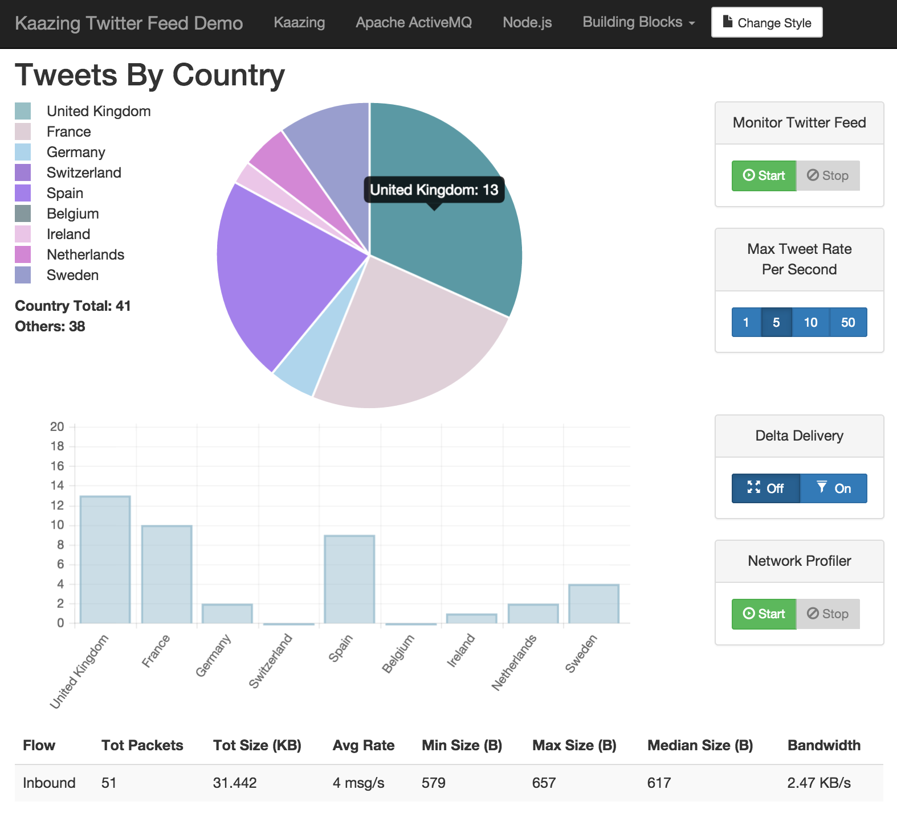

# KAAZING Twitter Feed Demo

This is a basic Twitter Streaming API demo. There are 2 main components :

- server  that runs under Node.js. The server process listens to a filtered Twitter stream via the Twitter Streaming API. At periodic intervals it republishes the most recent Tweet as a STOMP message to an instance of Apache ActiveMQ. 

- HTML5 web client that connects to ActiveMQ via KAAZING Gateway JMS edition v4.0.6, subscribes to the Twitter stream destination and displays various metrics in the dashboard.


## Running locally

This demo assumes that KAAZING Gateway JMS Edition v4.0.6 and Apache ActiveMQ 5.10.0 are already installed. Once they are installed and configured, execute the following steps in order to run the demo locally :


##### Clone the repository

Either download the repository as a .zip file or use git...

```Shell
git clone https://github.com/rich-cullen/KaazingTwitterFeedDemo.git
````


##### Install server Node.js dependencies

The server runs as a Node.js process, and the single script requires 3 npm modules to be installed.

```Shell
npm install twit
npm install stomp
npm install nconf
```

##### Run ActiveMQ

NB. Configuration may be required.


##### Run KAAZING Gateway JMS Edition v4.0.x

NB. Configuration may be required. It is assumed that the gateway will be exposing an unprotected, CORS accessible JMS service on "ws://your-domain-name-here.com:8001/jms".


##### Host the web client

The simplest way to do this is to run a Python web server from the directory containing index.html

```Shell
python -m SimpleHTTPServer 8080
```

##### Start the HTML5 client 

Browse to http://localhost:8080/index.html


##### Configure the Node.js server

The configuration file server/twitterStreamingApiStompBridgeConfig.json must be updated to contain :

- your Twitter access tokens and keys. More info on obtaining Twitter access tokens is available [here](https://dev.twitter.com/oauth/overview).

- connection details for the instance of ActiveMQ being used.


##### Start the Node.js server process

```Shell
node server/twitterStreamingApiStompBridge.js
```


##### Use the UI

The client should automatically connect to KAAZING Gateway and provide visual confirmation that this has been successful. The Twitter Feed Control will also be enabled once connected. Click Start to begin monitoring the live Twitter stream.

## Client Preview

</img>